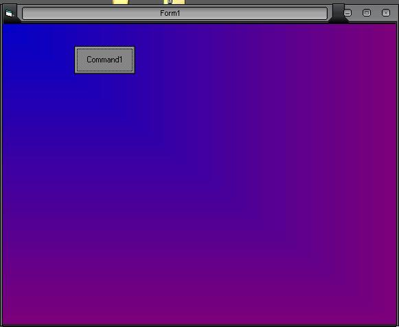

<div align="center">

## New FAST Gradient Example \- 3 different directions\!


</div>

### Description

Creates a gradient background (VERY FAST). and much cleaner than the screenshot (crappy jpgs). Can do up to 3 different directions! left to right, top to bottom, and diagonal. Please give me aosme feedback on this n vote plz :)
 
### More Info
 


<span>             |<span>
---                |---
**Submitted On**   |2004-12-12 00:59:30
**By**             |[Macro\-Pc](https://github.com/Planet-Source-Code/PSCIndex/blob/master/ByAuthor/macro-pc.md)
**Level**          |Intermediate
**User Rating**    |4.7 (14 globes from 3 users)
**Compatibility**  |VB 6\.0
**Category**       |[Windows API Call/ Explanation](https://github.com/Planet-Source-Code/PSCIndex/blob/master/ByCategory/windows-api-call-explanation__1-39.md)
**World**          |[Visual Basic](https://github.com/Planet-Source-Code/PSCIndex/blob/master/ByWorld/visual-basic.md)
**Archive File**   |[New\_FAST\_G18284712122004\.zip](https://github.com/Planet-Source-Code/macro-pc-new-fast-gradient-example-3-different-directions__1-57687/archive/master.zip)

### API Declarations

```
Public Declare Function CreateSolidBrush Lib "gdi32.dll" (ByVal crColor As Long) As Long
Public Declare Function DeleteObject Lib "gdi32.dll" (ByVal hObject As Long) As Long
Public Declare Function FillRect Lib "user32.dll" (ByVal hdc As Long, ByRef lpRect As RECT, ByVal hBrush As Long) As Long
Public Declare Function GetDeviceCaps Lib "gdi32.dll" (ByVal hdc As Long, ByVal nIndex As Long) As Long
```


